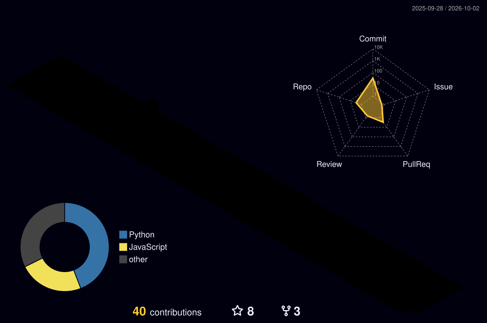

<!-- ========== WAVE BANNER (header) ========== -->

<!-- ========== TYPING ANIMATION ========== -->

  

  📍 Buffalo, NY &nbsp;·&nbsp; 🎓 MS, University at Buffalo &nbsp;·&nbsp; 💼 Previously ML Engineer at Verloop.io

  
  
  

---

## 🚀 Featured Projects

### 🧠 [QuillAI](https://github.com/Adishirsath/QuillAI)

**Autonomous Data Analysis Agent**

An agentic system that plans analysis tasks, generates and executes Python in an isolated sandbox, observes results, and self-corrects failed executions.

**Architecture**

`User → Planner → Code Generation → E2B Sandbox → Observation → Self-Correction → Results`

**Key engineering work**

- 🔄 Plan → Execute → Observe → Adapt agent loop
- 🧠 Redis working memory + ChromaDB episodic memory
- 🛠️ Sandboxed Python execution with E2B
- 🔁 Up to 3 automatic self-correction attempts
- ⚡ FastAPI WebSocket streaming
- 🧪 Evaluation framework across 32 tasks and 4 datasets
- 📊 7 evaluation metrics

---
## 🔬 Currently Building

### ⚙️ AgentOps
An engineering layer for reliable agentic AI systems, focused on evaluation, regression testing, guardrails, experiment tracking, and containerized serving.

**MLflow · GitHub Actions · FastAPI · Docker · Kind · Unsloth · NeMo Guardrails**

## 🛠 Stack

  

  
  
  
  

## 📊 GitHub Stats

  

[//]: # (  )

<!-- STREAK (delete if it looks empty) -->

  

## 🏆 Contributions

<!-- 3D CONTRIBUTION GRAPH -->

  

---

  🤖 AI/ML &nbsp;·&nbsp; 💡 Building with AI &nbsp;·&nbsp; 📫 <a href="mailto:adityashirsath4@gmail.com">Let's talk</a>

<!-- ========== WAVE BANNER (footer) ========== -->

